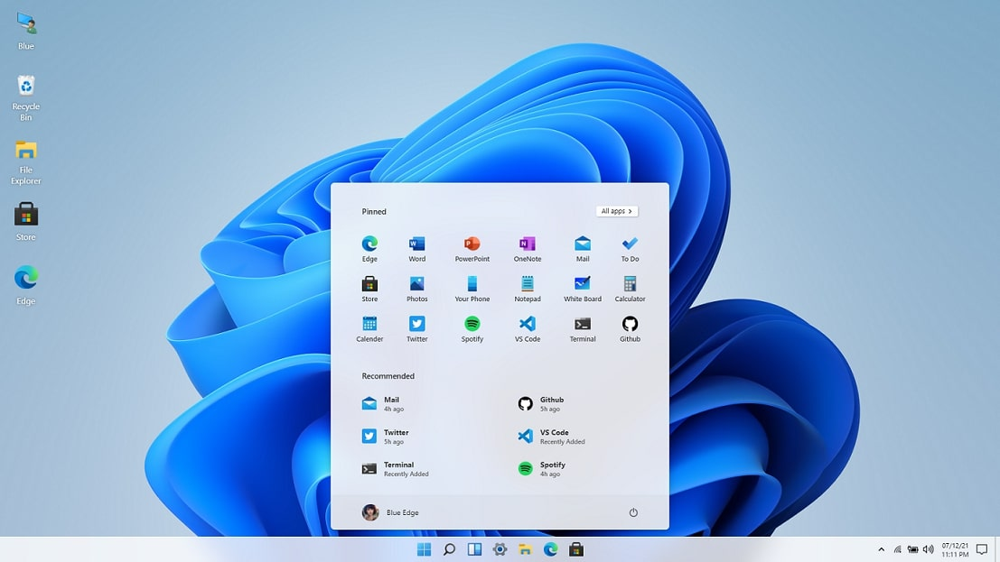

# Win11React

#### Live Experience🌈: [win11.suresh.app](https://win11.suresh.app)

# Features

- [x] Start Menu, Search Menu and Widgets
- [x] Desktop and Right Click action
- [x] Side Navigation and Calendar View
- [x] Snap windows in different layouts
- [x] Browser, Store, Terminal, Calculator
- [x] Notepad, Vscode, Whiteboard
- [x] File Explorer + Setting
- [x] Drag and Resize windows
- [x] Startup and Lock screen
- [x] Themes and Background
- [x] Multilang Support

# Stack

- Framework - React (^17.0.2) + Redux
- Component/UI Library - None!!
- Styling Solution - SCSS and CSS Modules (tailwind).
- Icons - fontawesome

## License

⚖️ SURESH NETWORK
